# User Flow — Mission Journey

> Source: Figma — `[HandOver] Collection of UX/UI Research Case Studies`
> Page: `↳ ✅ Mission/Gamification` · Section: `User Flow — Mission Journey` (`997:50213`)
> Extracted: 2026-08-05 · 8363 × 1345 px · 29 nodes + 29 connectors

> ⚠️ **นี่คือ snapshot ของ Figma ณ 2026-08-05 ไม่ใช่ flow ที่จะ implement**
> flow ที่ใช้จริง → `features/gamification/ux-gamification.md` §3
>
> | node ในไฟล์นี้ | สถานะปัจจุบัน |
> |---|---|
> | `Onboarding` + decision `เข้าภารกิจนี้ครั้งแรก?` | ⏸️ เลื่อนออก — ทุกคนเข้าหน้าเดียวกัน (ux §2.2) |
> | `แสดง tier ที่ยังไม่ครบ` (D5) | ❌ ขัด MECH-02 — ห้ามใช้คำว่า tier ใน UI · แทนด้วย "เงื่อนไขที่ยังขาด + preview รางวัล" |
> | `D8 สินค้าเป็นคูปอง ไม่ใช่สินค้า?` (แตก 2 ทาง) | 🔁 แตกเป็น **3 ทาง** ตาม `reward_type` — `NOKPOINT` / `E_COUPON` / `PHYSICAL` (prd-dev §2.1.1) |
> | `รอรับสินค้าที่บ้าน` | ❌ ตัดถาวร — CRM ส่งสถานะกลับไม่ได้ ใช้ LINE OA แทน |
> | ไม่มี error / loading / back path | ✅ เติมแล้วใน ux §3.4, §6 |
>
> **ยังไม่มีเจ้าภาพแก้ Figma ต้นทาง** — 3 อย่างค้างอยู่: node `tier`, orphan node ซ้อน, typo D6 (ดู §ข้อสังเกตท้ายไฟล์)

---

## Diagram

```mermaid
flowchart LR
    home([Home]) --> banner[banner ภารกิจคนจะรวย]
    service([บริการ]) --> icon[Icon ภารกิจคนจะรวย]

    banner --> d1{เข้าภารกิจนี้<br/>ครั้งแรก?}
    icon --> d1

    d1 -->|ใช่| onboarding[Onboarding]
    d1 -->|ไม่ใช่| list[List ภารกิจทั้งหมด]

    onboarding --> d2{มี Mission<br/>ใช่หรือไม่?}
    d2 -->|ใช่| list
    d2 -->|ไม่| empty[Empty state]

    list --> d3{เข้ามาทำภารกิจ<br/>บ้างไหม?}
    d3 -->|ไม่ใช่| modalRemind[/Modal แจ้งเตือนให้ user มาทำภารกิจ<br/>+ CTA ดูภารกิจทั้งหมด/]
    d3 -->|ใช่| pick[เลือกทำภารกิจที่สนใจ]

    pick --> d4{ทำครบเงื่อนไข<br/>ใช่ไหม?}
    d4 -->|ไม่ใช่| list
    d4 -->|ใช่| points[ได้รับคะแนน]

    points --> d5{คะแนนครบตามภารกิจ<br/>กำหนดใช่ไหม?}
    d5 -->|ไม่ใช่| tier[แสดง tier ที่ยังไม่ครบ<br/>+ เงื่อนไขปลดล็อก + preview รางวัล]
    d5 -->|ใช่| success[ภารกิจสำเร็จ ปลดล็อก<br/>+ CTA รับรางวัล]

    success --> d6{ยังไม่เคยรับรางวัลนี้<br/>ใช่หรือไม่}
    d6 -->|ไม่ใช่| claimed[รายละเอียดภารกิจแสดงปุ่ม 'รับแล้ว'<br/>+ Modal ให้ใช้คูปอง/รับของ + CTA ใช้คูปอง]
    d6 -->|ใช่| d7{สินค้า/คูปองยังไม่หมดอายุ<br/>และยังเหลืออยู่ ใช่ไหม?}

    d7 -->|ไม่ใช่| expired[รายละเอียดภารกิจแสดงปุ่ม 'แจ้งหมด/หมดอายุ'<br/>+ Modal แจ้งเตือนก่อนหมดอายุ + CTA ใช้คูปอง]
    d7 -->|ใช่| d8{สินค้าเป็นคูปอง<br/>ไม่ใช่สินค้า ใช่ไหม}

    d8 -->|ใช่| claimCoupon[กดรับรางวัล — คูปอง]
    d8 -->|ไม่ใช่| claimGoods[กดรับรางวัล — สินค้า]

    claimCoupon --> done([รับรางวัลสำเร็จ])
    claimGoods --> form[กรอกรายละเอียดเพื่อรับรางวัล]
    form --> wait[รอรับสินค้าที่บ้าน]
    wait --> done
```

---

## Entry points

| # | Entry | Element | ปลายทาง |
|---|---|---|---|
| 1 | Home | `banner ภารกิจคนจะรวย` | Decision: เข้าภารกิจนี้ครั้งแรก? |
| 2 | บริการ | `Icon ภารกิจคนจะรวย` | Decision: เข้าภารกิจนี้ครั้งแรก? |

ทั้ง 2 ทางมาบรรจบที่ decision เดียวกัน

---

## Decision points

| # | คำถาม (verbatim) | ใช่ | ไม่ใช่ |
|---|---|---|---|
| D1 | เข้าภารกิจนี้ครั้งแรก? | → Onboarding | → List ภารกิจทั้งหมด |
| D2 | มี Mission ใช่หรือไม่? | → List ภารกิจทั้งหมด | → Empty state |
| D3 | เข้ามาทำภารกิจบ้างไหม? | → เลือกทำภารกิจที่สนใจ | → Modal แจ้งเตือนให้มาทำภารกิจ + CTA ดูภารกิจทั้งหมด |
| D4 | ทำครบเงื่อนไขใช่ไหม? | → ได้รับคะแนน | → ย้อนกลับ List ภารกิจทั้งหมด |
| D5 | คะแนนครบตามภารกิจกำหนดใช่ไหม? | → ภารกิจสำเร็จ ปลดล็อก + CTA รับรางวัล | → แสดง tier ที่ยังไม่ครบ + เงื่อนไขปลดล็อก + preview รางวัล |
| D6 | ยังเคยรับรางวัลนี้ ใช่หรือไม่ ⚠️ | → เช็คสินค้า/คูปองหมดอายุ (D7) | → รายละเอียดภารกิจแสดงปุ่ม "รับแล้ว" + Modal ใช้คูปอง/รับของ |
| D7 | สินค้า/คูปองยังไม่หมดอายุและยังเหลืออยู่ ใช่ไหม? | → เช็คประเภทรางวัล (D8) | → ปุ่ม "แจ้งหมด/หมดอายุ" + Modal แจ้งเตือนก่อนหมดอายุ |
| D8 | สินค้าเป็นคูปอง ไม่ใช่สินค้า ใช่ไหม | → กดรับรางวัล (คูปอง) → รับรางวัลสำเร็จ | → กดรับรางวัล (สินค้า) → กรอกรายละเอียด → รอรับสินค้าที่บ้าน → รับรางวัลสำเร็จ |

⚠️ D6 ข้อความใน Figma เขียนว่า "ยังเคยรับ รางวัลนี้ ใช่หรือไม่" — ตาม logic ปลายทาง (ใช่ = ไปรับรางวัลต่อ) น่าจะตั้งใจเขียนว่า **"ยังไม่เคยรับรางวัลนี้"** ควรแก้ข้อความ

---

## Screens / States

### Main path
| Screen | ประเภท |
|---|---|
| Home | Entry |
| บริการ | Entry |
| banner ภารกิจคนจะรวย | Entry component |
| Icon ภารกิจคนจะรวย | Entry component |
| Onboarding | Page |
| List ภารกิจทั้งหมด | Page |
| เลือกทำภารกิจที่สนใจ | Page |
| ได้รับคะแนน | Page |
| ภารกิจสำเร็จ ปลดล็อก + CTA รับรางวัล | Page |
| กดรับรางวัล (คูปอง) | Page |
| กดรับรางวัล (สินค้า) | Page |
| กรอกรายละเอียดเพื่อรับรางวัล | Page |
| รอรับสินค้าที่บ้าน | Page |
| รับรางวัลสำเร็จ | End state |

### Edge / Unhappy path
| State | Trigger |
|---|---|
| Empty state | ไม่มี Mission (D2 = ไม่) |
| Modal แจ้งเตือนให้ user มาทำภารกิจ + CTA ดูภารกิจทั้งหมด | ไม่เข้ามาทำภารกิจ (D3 = ไม่ใช่) |
| แสดง tier ที่ยังไม่ครบ + เงื่อนไขปลดล็อก + preview รางวัล | คะแนนไม่ครบ (D5 = ไม่ใช่) |
| รายละเอียดภารกิจแสดงปุ่ม "รับแล้ว" + Modal ใช้คูปอง/รับของ + CTA ใช้คูปอง | รับรางวัลนี้ไปแล้ว (D6 = ไม่ใช่) |
| รายละเอียดภารกิจแสดงปุ่ม "แจ้งหมด/หมดอายุ" + Modal แจ้งเตือนก่อนหมดอายุ + CTA ใช้คูปอง | คูปองหมดอายุ/ของหมด (D7 = ไม่ใช่) |

---

## Loop

- **D4 = ไม่ใช่** (ทำเงื่อนไขไม่ครบ) → ย้อนกลับ `List ภารกิจทั้งหมด` — loop เดียวใน flow นี้

---

## Annotation (sticky note จาก Beer-Woranittha Pangsang)

วางไว้ใต้ `List ภารกิจทั้งหมด`:

> - กำหนดให้ User ทุกคนเห็นเหมือนกันหมด
> - การ์ดภารกิจควรโชว์: progress X/Y · deadline · รางวัล (hook)
> → ลด anxiety + goal-gradient

---

## ข้อสังเกตจาก Figma structure

| ประเด็น | รายละเอียด |
|---|---|
| Duplicate node | มี frame `กดรับรางวัล` 2 ตัวซ้อนกันที่พิกัดเดียวกัน (`1015:585` + `1026:37128`) — `1026:37128` ไม่มี connector เชื่อม เป็น orphan ควรลบ |
| Copy typo D6 | "ยังเคยรับ รางวัลนี้" ควรเป็น "ยังไม่เคยรับรางวัลนี้" |
| ไม่มี error/loading state | flow ยังไม่ครอบคลุมกรณี API fail / network error ตอนกดรับรางวัล |
| ไม่มี back path จาก edge state | Empty state, tier ที่ยังไม่ครบ, "รับแล้ว", "หมดอายุ" — ไม่มีลูกศรออกกลับไป List |
