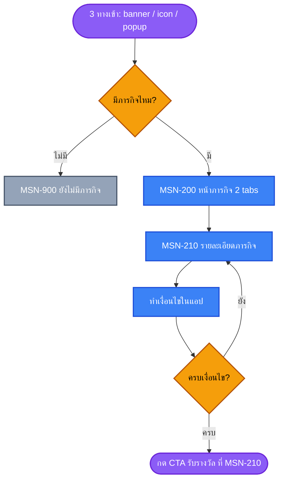
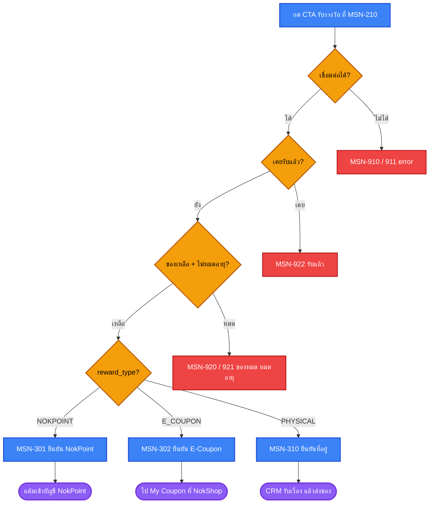
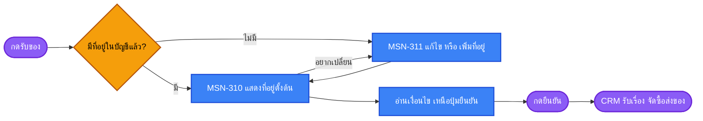
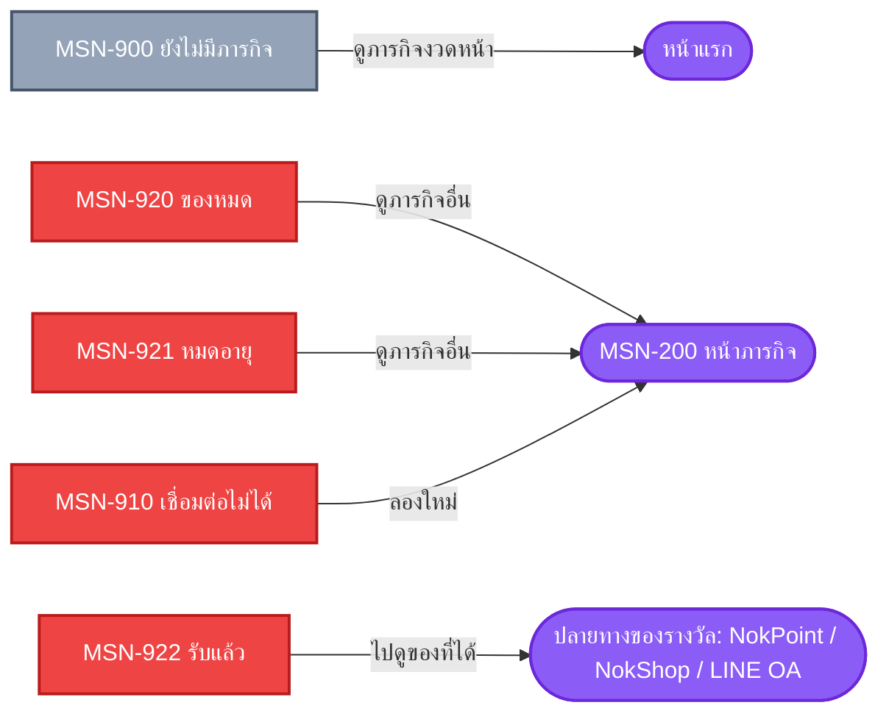

# UX Blueprint: Mission & Gamification

> **ขอบเขตของ blueprint รอบนี้** — ปิดช่องว่าง 4 อย่างที่ flow เดิมไม่มี แล้วทำให้ตัด ticket ได้โดยไม่ชนกัน
> 1. error / loading state ตอนกดรับรางวัล
> 2. back path จาก edge state
> 3. ชื่อหน้าจอที่ design กับ dev ใช้ร่วมกัน
> 4. IA ของ tab — และการชนกับ IA ที่มีอยู่แล้วในแอป

**อัปเดต 2026-08-06** — ตัด tab รางวัลออก · claim ย้ายไปอยู่ที่หน้ารายละเอียดภารกิจ · แยก reward เป็น 3 ชนิดที่มี flow ต่างกัน
**อัปเดต 2026-08-23** — ล้างซาก `MSN-110` · reconcile จำนวน frame เป็น **21** · เติมปลายทาง `PHYSICAL` (LINE OA) ที่ตกไป · progress บนการ์ดแตกเป็น **3 รูปแบบ** ตามโครงสร้าง Mission:Task ที่ได้จาก Figma (prd §6.0)

---

## 1. 🎯 Strategy & Context

| | |
|---|---|
| **Problem Statement** | ลูกค้าใหม่ 100 คน เหลือ 28 คนในงวดถัดไป (−72%) และเหลือ 5 คนเมื่อครบ 6 งวด — คนหายที่จุดเดียวคืองวดที่ 2 `[source: prd §1]` |
| **User Goal** | รู้ว่ามีอะไรให้ทำ · เห็นว่าตัวเองไปถึงไหนแล้ว · ได้ของที่สัญญาไว้โดยไม่ต้องตามหา `[source: prd §3]` |
| **Business Goal** | ลดต้นทุนหาลูกค้าใหม่ที่ต้องจ่ายซ้ำทุกงวด + ดัน Jidrid adoption `[source: prd §1]` |
| **Success Metrics** | M1 — BELOW_50 → BEGINNER 10% (121,531 คน) · M2 — FREQ EASY → NORMAL 22.5% (22,448 คน) `[source: prd §1]` |
| **Mechanic** | ทำภารกิจสำเร็จ = ได้รางวัลทันที · ไม่มี tier status ติดตัว · **จุด claim อยู่ที่หน้ารายละเอียดภารกิจเท่านั้น** `[source: prd MECH-01/02/05]` |

### 1.1 ✅ IA collision — แก้แล้ว

sitemap V.7.0.0 บอกว่าแอปมีของพวกนี้อยู่แล้ว `[source: docs/sitemap.md]` — การตัดสินใจ 2026-08-06 แก้ collision ไปได้ 2 ใน 4 จุด

| ของที่มีอยู่แล้ว | อยู่ที่ไหน | สถานะ |
|---|---|---|
| **คูปองของฉัน / My Coupon** | สมาชิก → คูปองของฉัน (NokShop) | ✅ **แก้แล้ว** — ไม่สร้าง wallet ซ้อน · `E_COUPON` claim แล้ว redirect ไปหน้านี้เลย |
| **นกพอยต์ / NokPoint** | บริการ → นกพอยต์ | ✅ **แก้แล้ว** — `NOKPOINT` เข้าบัญชีเดิม ไม่ใช่สกุลใหม่ |
| **จิ๊ดริดหยิบโชค** | หน้าแรก (section ของตัวเอง) | 🟡 mission ที่ชวนลอง Jidrid ควร deep link ไปที่นี่ ไม่สร้างทางเข้าใหม่ |
| **แถวบริการ** (8 รายการ) | หน้าแรก + สมาชิก | 🟡 เพิ่ม icon ภารกิจ = 9 รายการ เกิน Miller's Law 7±2 → **D-03** |

> ⚠️ sitemap ลงวันที่ 2025-05-09 (V.7.0.0) — ต้อง verify ว่ายังตรงกับ production ก่อนยึดเป็นฐาน

### 1.2 หลักการที่ได้จากการตัดสินใจรอบนี้

**BP-00 — ระบบภารกิจไม่เก็บของ มันแค่ปลดล็อกแล้วส่งต่อ**

ของที่ได้จากภารกิจไปอยู่ในระบบที่ผู้ใช้รู้จักอยู่แล้ว (NokShop / NokPoint / ของส่งถึงบ้าน) ระบบภารกิจมีหน้าที่แค่ทำให้ครบเงื่อนไข แล้วส่งไม้ต่อ
**เหตุผล:** ลดจำนวนที่ที่ผู้ใช้ต้องจำ และไม่แข่งกับ IA เดิมของแอป

---

## 2. 🗂️ Screen Inventory & Naming

**กติกาการตั้งชื่อ:** `MSN-<ระดับ><ลำดับ>` — design, dev, QA, analytics ใช้ id ชุดเดียวกัน
ระดับ: `0xx` entry · `1xx` onboarding · `2xx` list/detail · `3xx` claim · `9xx` system state

| ID | ชื่อหน้าจอ (TH) | ประเภท | Stage | หมายเหตุ |
|---|---|---|---|---|
| `MSN-001` | Banner ภารกิจ (หน้าแรก) | Component | Awareness | `[ENT-01]` |
| `MSN-002` | Icon ภารกิจ (แถวบริการ) | Component | Awareness | `[ENT-02]` · ขึ้นกับ D-03 |
| `MSN-003` | **Popup ภารกิจสำเร็จ** | Modal | Awareness | **ใหม่** `[ENT-03]` · เด้งทันทีเมื่อทำภารกิจสำเร็จ ไม่ว่าอยู่หน้าไหน · ขึ้นกับ D-04 |
| ~~`MSN-100`~~ | ~~Onboarding — ทักทาย~~ | — | — | ⏸️ **เลื่อนออก** `[user 2026-08-06]` — รอขายผ่านก่อน |
| ~~`MSN-110`~~ | ~~วิธีใช้งานภารกิจ~~ | — | — | ⏸️ **เลื่อนออก** — รอขายผ่านก่อน |
| `MSN-200` | ภารกิจ (หน้าหลัก + 2 tabs) | Page | Mission | AC-302 |
| `MSN-201` | ↳ tab ทั้งหมด | Tab | Mission | |
| `MSN-202` | ↳ tab สำเร็จแล้ว | Tab | Mission | |
| `MSN-210` | **รายละเอียดภารกิจ** | Page | Mission → Reward | AC-301 / AC-505 · **เป็นจุด claim เดียวของระบบ** (MECH-05) |
| `MSN-300` | ยืนยันรับรางวัล | Bottom sheet | Reward | แตกเป็น 3 variant ตามชนิดรางวัล |
| `MSN-301` | ↳ variant `NOKPOINT` | Bottom sheet | Reward | AC-504 |
| `MSN-302` | ↳ variant `E_COUPON` | Bottom sheet | Reward | AC-501 |
| `MSN-310` | **ยืนยันที่อยู่รับของ** | Page / Sheet | Reward | AC-502 · prefill จาก `สมาชิก → ที่อยู่ของฉัน` |
| `MSN-311` | แก้ไข / เพิ่มที่อยู่ | Form | Reward | เรียกจาก `MSN-310` |
| `MSN-330` | รับรางวัลสำเร็จ | Bottom sheet | Reward | มี 3 variant ตามชนิดรางวัล |
| `MSN-500` | Modal "เหลืออีกนิดเดียว" | Modal | Follow up | AC-401 |
| `MSN-900` | Empty — ยังไม่มีภารกิจ | State | Onboarding | AC-202 |
| `MSN-910` | Error — เชื่อมต่อไม่ได้ | State | ทุก stage | **ใหม่** |
| `MSN-911` | Error — รับรางวัลไม่สำเร็จ | State | Reward | **ใหม่** |
| `MSN-920` | ของหมด | State | Reward | flow (D7) |
| `MSN-921` | หมดอายุ | State | Reward | flow (D7) |
| `MSN-922` | รับแล้ว | State | Reward | flow (D6) · ต้องมีทางไปปลายทางของรางวัลนั้น |

### 2.1 หน้าจอที่ **ตัดออก** จาก version ก่อน

| ตัดอะไร | เพราะอะไร |
|---|---|
| ~~`MSN-203` tab รางวัลของฉัน~~ | ไม่มี tab รางวัลแล้ว — ของไปอยู่ที่ NokShop / NokPoint (MECH-05) |
| ~~`MSN-400` รายละเอียดคูปอง~~ | เป็นหน้าของ **NokShop ที่มีอยู่แล้ว** ระบบภารกิจไม่สร้างเอง |
| ~~`MSN-901` Empty — ยังไม่มีรางวัล~~ | ตายตาม tab รางวัล |
| ~~`MSN-320` สถานะการจัดส่ง~~ | ✅ ตัดถาวร — **CRM ส่งสถานะกลับไม่ได้** `[user 2026-08-06]` · ผู้ใช้ติดตามผ่าน **LINE OA** แทน |

**ตัดออก 4 รายการ** และตัด dependency ที่ไม่แน่นอนออกไป 2 ตัว (สถานะจัดส่งจาก CRM · หน้าคูปองของระบบภารกิจ)

### 2.2 ⏸️ Onboarding เลื่อนออก — และผลที่ตามมา

`[user 2026-08-06]` — ไม่ทำ onboarding ในรอบนี้ รอขายผ่านก่อนค่อยกลับมาเก็บ

**นับ frame ที่ต้องวาดจริง — 21**

| | จำนวน | หมายเหตุ |
|---|---|---|
| แถวใน §2 ที่ยังไม่ถูกตัด | 20 | ไม่นับ `MSN-100` / `MSN-110` ที่เลื่อนออก |
| − `MSN-300` | −1 | เป็น parent เชิงแนวคิด ไม่ได้วาดเอง — วาดที่ `MSN-301` / `MSN-302` / `MSN-310` |
| + `MSN-330` แตกเป็น 3 variant | +2 | `330a` NokPoint · `330b` E-Coupon · `330c` ของส่งถึงบ้าน |
| **รวม** | **21** | = T1 (17) + T2 (4) ในไฟล์ `tickets.md` |

การเลื่อนออกไม่ใช่แค่ลบ 2 หน้าจอ — มีของ 3 อย่างที่เคยฝากไว้กับ onboarding และตอนนี้ไม่มีบ้าน

| ของที่หายไปด้วย | เดิมอยู่ที่ | ต้องย้ายไปไหน |
|---|---|---|
| แจ้ง **อายุของรางวัล/คูปอง** ตั้งแต่ต้น (AC-201) | `MSN-100` | → **`MSN-210`** ต้องแสดงก่อนผู้ใช้เริ่มทำภารกิจ (BP-02 อยู่แล้ว) |
| อธิบายว่า **ระบบทำงานยังไง** | `MSN-110` | → เนื้อหาต้องอ่านออกจาก `MSN-201` + `MSN-210` โดยไม่ต้องมีใครสอน |
| ปุ่ม "วิธีใช้งาน" ใน header ของ `MSN-200` | ชี้ไป `MSN-110` | → **ตัดปุ่มออก** หรือชี้ไป `วิธีการใช้งาน` ที่มีอยู่แล้วในเมนูหลัก `[source: docs/sitemap.md]` — ต้องตัดสิน (D-06) |

**BP-10 — ถ้าไม่มี onboarding การ์ดกับหน้ารายละเอียดต้องอธิบายตัวเองได้**

เงื่อนไข · progress · รางวัล · โควตา · อายุรางวัล ต้องอ่านรู้เรื่องจากหน้าจอเดียว โดยไม่ต้องมีหน้าสอนมาก่อน
**เหตุผล:** เมื่อไม่มีจุดที่ใครมาอธิบาย ภาระการอธิบายตกไปอยู่ที่ตัว UI ทั้งหมด — ถ้าหน้าเดียวอ่านไม่รู้เรื่อง ผู้ใช้จะออกโดยไม่เริ่มเลย

---

## 3. 🛣️ User Flow

### 3.1 Happy path — เข้าจนกดรับ



> **หมายเหตุ:** decision `เข้าภารกิจนี้ครั้งแรก?` ใน flow เดิม `[flow]` หายไปพร้อม onboarding — ทุกคนเข้าหน้า `MSN-200` เหมือนกันหมด ไม่ว่าครั้งแรกหรือไม่

### 3.2 Claim chain — แตก 3 ทางตามชนิดรางวัล



### 3.3 `PHYSICAL` — ขั้นตอนย่อย



**BP-06:** เงื่อนไข (`ระยะเวลาดำเนินการ · สละสิทธิ์ถ้าติดต่อไม่ได้ · หมดแล้วหมดเลย`) ต้องอยู่**เหนือ**ปุ่มยืนยันเสมอ
**เหตุผล:** `PHYSICAL` เป็นเส้นทางเดียวที่ผู้ใช้รอของนาน และมีเงื่อนไขสละสิทธิ์ — ถ้าไปเจอทีหลังจะกลายเป็นเรื่องร้องเรียน `[source: prd R-05]`

### 3.4 Back path — ทางออกจากทุก dead end



**BP-01:** ทุก state ใน `9xx` ต้องมี CTA อย่างน้อย 1 ปุ่มที่พาออกไปหน้าที่ทำอะไรต่อได้
**เหตุผล:** Nielsen #3 User control and freedom — dead end ทำให้ผู้ใช้ต้องกด back ระบบปฏิบัติการ ซึ่งอาจหลุดออกจาก flow ทั้งหมด

---

## 4. 🏗️ Information Architecture

### 4.1 MSN-200 — หน้าภารกิจ

```
┌ Header ─────────────────────────────────────┐
│ ชื่อฟีเจอร์  ⚠️ ไม่มีปุ่มวิธีใช้งาน (D-06)    │
├ Tabs ───────────────────────────────────────┤
│ [ทั้งหมด]  [สำเร็จแล้ว]                       │
├ Content ────────────────────────────────────┤
│ Mission card × n  (เรียงตาม §4.2)           │
└─────────────────────────────────────────────┘
```

**2 tab เท่านั้น** — ของที่รับแล้วไม่ได้เก็บที่นี่ ต้องไปดูที่ NokShop / NokPoint (BP-00)

`tab สำเร็จแล้ว` ทำหน้าที่เป็นประวัติว่าทำอะไรจบไปแล้วบ้าง กดเข้าไปที่ `MSN-210` จะเห็นสถานะ "รับแล้ว" พร้อมทางไปปลายทางของรางวัลนั้น

### 4.2 ลำดับการเรียง mission card (default `ทั้งหมด`)

| ลำดับ | กลุ่ม | เหตุผล |
|---|---|---|
| 1 | ใกล้สำเร็จที่สุด (progress % สูงสุด) | goal-gradient — คนเร่งเมื่อใกล้เส้น `[source: prd AC-401]` |
| 2 | ใกล้หมดเวลา | urgency ที่มีเหตุผลจริง |
| 3 | ยังไม่เริ่ม | |
| 4 | ของหมด / หมดอายุ (แสดงแบบ disabled ไม่ซ่อน) | Nielsen #1 — ซ่อนแล้วผู้ใช้คิดว่าระบบพัง |

### 4.3 Mission card — ลำดับข้อมูล

| ลำดับสายตา | ข้อมูล | เหตุผล |
|---|---|---|
| 1 | รางวัล (ภาพ + ชื่อ) | เป็นเหตุผลเดียวที่ทำให้หยุดอ่าน |
| 2 | เงื่อนไข 1 บรรทัด | ตัดสินใจว่าทำไหวไหม |
| 3 | Progress + หมุดระหว่างทาง — **รูปแบบต่างกัน 3 แบบตามกลุ่มภารกิจ** (prd §6.0) | ตอบ "ฉันอยู่ตรงไหน" |
| | ↳ VOLUME ขั้นล่าง = `X/Y` + **3 หมุดชนิดเดียวกัน** · VOLUME ขั้นบน = `X/Y` เส้นเดียวไม่มีหมุด · **FREQUENCY = 2 เส้นแยกกัน** (งวด + Jidrid) | เงื่อนไขคนละชนิดรวมเป็นเส้นเดียวไม่ได้ — ผู้ใช้จะอ่านไม่ออกว่าค้างที่อันไหน (prd MT-02) |
| 4 | เหลืออีกกี่วัน | ตอบ "ต้องรีบไหม" |
| 5 | โควตาคงเหลือ (ถ้ามีจำกัด) | ตอบ "ยังทันไหม" `[source: prd AC-505]` |

### 4.4 MSN-210 — รายละเอียดภารกิจ (จุด claim เดียวของระบบ)

```
┌ Hero ──────────────┐  รางวัล + ชื่อภารกิจ + ช่วงเวลาแคมเปญ
├ Progress ──────────┤  X/Y + หมุด + เหลืออีกกี่วัน
├ เงื่อนไข ───────────┤  แตกเป็นขั้นย่อย ถ้ามี
├ โควตา & เงื่อนไข ───┤  จำนวนคงเหลือ · อายุคูปอง · เงื่อนไขของรางวัลสินค้า
└ CTA ───────────────┘  ปุ่มเดียว เปลี่ยนตามสถานะ
```

**สถานะของ CTA เดียวนี้ — 5 แบบ**

| สถานะ | ปุ่มแสดงว่า | กดแล้วไปไหน |
|---|---|---|
| ยังไม่ครบเงื่อนไข | ไปทำภารกิจ | deep link ไปหน้าที่ทำได้ (เช่น จิ๊ดริดหยิบโชค) |
| ครบแล้ว ยังไม่รับ | รับรางวัล | `MSN-300` variant ตามชนิด |
| รับแล้ว | รับแล้ว (disabled) + ลิงก์รอง | ปลายทางตามชนิดรางวัล — `NOKPOINT` → หน้า NokPoint · `E_COUPON` → My Coupon (NokShop) · `PHYSICAL` → **ปุ่ม LINE OA + หมายเลขอ้างอิงคำร้อง** (SLA-03, SLA-04) |
| ของหมด | หมดแล้ว (disabled) | — พร้อมลิงก์ดูภารกิจอื่น |
| หมดอายุ | หมดอายุ (disabled) | — พร้อมลิงก์ดูภารกิจอื่น |

**BP-02:** โควตา อายุรางวัล และเงื่อนไข ต้องอยู่ **เหนือ CTA** เสมอ
**เหตุผล:** persona กลุ่ม INNOCENT ต้องการ "ปลอดภัย + โปร่งใส" และ value FAIR FOR TRUST ระบุว่า trust เสีย = งานล้มเหลวทันที `[source: brand-book-core.md, prd R-04]`

### 4.5 MSN-330 — หน้าสำเร็จ 3 variant

| Reward type | ต้องบอกอะไร | CTA หลัก | CTA รอง |
|---|---|---|---|
| `NOKPOINT` | ได้กี่แต้ม · ยอดรวมใหม่ | ไปดู NokPoint | กลับไปดูภารกิจอื่น |
| `E_COUPON` | ได้คูปองอะไร · ใช้ได้ถึงเมื่อไหร่ | ไปที่ My Coupon (NokShop) | กลับไปดูภารกิจอื่น |
| `PHYSICAL` | รับเรื่องแล้ว · จะเกิดอะไรต่อ · **หมายเลขอ้างอิงคำร้อง** | **สอบถามที่ LINE OA** | กลับไปดูภารกิจอื่น |

**BP-07:** หน้าสำเร็จของ `PHYSICAL` ต้องบอก **ขั้นตอนถัดไปที่เกิดนอกแอป** เพราะ **CRM ส่งสถานะกลับไม่ได้** — ผู้ใช้จะไม่เห็นความคืบหน้าใด ๆ ในแอปอีกเลยจนของถึงมือ `[user 2026-08-06]`

**BP-09 — ไม่มี SLA ก็ยังบอกได้ว่าเรื่องไม่หาย**

ระยะเวลาจริงยังไม่มีตัวเลข (OPEN-16) กติกาการเขียนจึงเป็น:

| ห้าม | ต้องมี |
|---|---|
| ตัวเลขวัน/สัปดาห์ที่ยังไม่ยืนยัน | "ได้รับเรื่องแล้ว" + "ทีมงานจะติดต่อกลับตามข้อมูลที่ให้ไว้" |
| คำคลุมเครือแบบ "เร็ว ๆ นี้" ที่ไม่บอกอะไร | **หมายเลขอ้างอิงคำร้องที่ copy ได้** |
| ปล่อยให้ผู้ใช้ไม่มีที่ถาม | ปุ่มไป **LINE OA** |

**เหตุผล:** ตัวเลขที่เดาแล้วพลาด = ผิดสัญญาโดยตรง ซึ่งกระทบ value FAIR FOR TRUST ที่ระบุว่า trust เสีย = งานล้มเหลวทันที `[source: brand-book-core.md]` · ส่วนหมายเลขอ้างอิงทำให้การถามผ่าน LINE OA ตอบได้เร็ว แทนที่ CRM จะต้องไล่ถามว่าใครคือใคร

---

## 5. 🈳 Empty state

| ID | เมื่อไหร่ | ต้องมีอะไร | ทางออก |
|---|---|---|---|
| `MSN-900` | ไม่มีภารกิจในงวดนี้ | เหตุผลที่ว่าง · งวดถัดไปเริ่มเมื่อไหร่ (ถ้ารู้) | → หน้าแรก |

**BP-03:** Empty state ห้ามเป็นหน้าเปล่าที่มีแค่ไอคอน — ต้องตอบ 2 คำถามเสมอ: *ทำไมว่าง* และ *แล้วให้ทำอะไรต่อ*

---

## 6. ⚠️ Error & Loading states

flow เดิมไม่มี error/loading เลยแม้แต่ตัวเดียว ทั้งที่ปลายทางเป็นของมูลค่าสูงสุด 90,000 บาท `[source: prd §5.8]`

### 6.1 Loading

| จุด | รูปแบบ | เกณฑ์ |
|---|---|---|
| โหลด `MSN-200` ครั้งแรก | Skeleton ของ mission card | ต้องเห็นโครงหน้าทันที ไม่ใช่จอขาว |
| สลับ tab | คงหน้าเดิมไว้ + loading เฉพาะ content | Nielsen #1 |
| กด claim | ปุ่มเข้าสถานะ loading + **ล็อกไม่ให้กดซ้ำ** | กัน double-claim ฝั่ง UI (server มี `ST-02` idempotency อยู่แล้ว) |
| ระหว่าง redirect ไป NokShop | ต้องมี feedback ก่อนออกจากแอปภารกิจ | ผู้ใช้กำลังถูกพาไปอีกส่วนของแอป — ถ้าเงียบจะงงว่าหลุดไปไหน |
| Progress ยังไม่ sync | ป้ายบนการ์ด บอกว่าอัปเดตภายในเวลาเท่าไหร่ | ผูกกับ `OPEN-05` |

### 6.2 Error

| ID | Trigger | ผู้ใช้เห็นอะไร | ทางออก |
|---|---|---|---|
| `MSN-910` | โหลด list / detail ไม่ได้ | บอกว่าเชื่อมต่อไม่ได้ + ปุ่มลองใหม่ | retry ในหน้าเดิม |
| `MSN-911` | claim แล้ว server ตอบ error ที่ไม่ใช่ business rule | บอกว่ายังไม่สำเร็จ + **ยืนยันว่าสิทธิ์ยังอยู่** + ปุ่มลองใหม่ | retry |
| `MSN-920` | `stock_left = 0` ตอนกด | บอกว่าของหมด | → ภารกิจอื่น |
| `MSN-921` | เลยวันหมดอายุ | บอกว่าหมดอายุแล้ว | → ภารกิจอื่น |
| `MSN-922` | เคย claim ไปแล้ว | บอกว่ารับไปแล้ว + ชี้ไปปลายทางของรางวัลชนิดนั้น (3 แบบ) | → NokPoint · My Coupon (NokShop) · **LINE OA + หมายเลขอ้างอิง** สำหรับ `PHYSICAL` |
| `MSN-311` | ที่อยู่ validate ไม่ผ่าน | error ระดับ **field** ไม่ใช่ก้อนเดียวรวมบนสุด | แก้ในหน้าเดิม |
| **ใหม่** | claim `E_COUPON` สำเร็จ แต่ redirect ไป NokShop ไม่ได้ | ต้องบอกว่า **คูปองออกให้แล้ว** และไปหาได้ที่ไหน | ให้ path แบบ manual ไปที่ My Coupon |

**BP-04:** `MSN-911` ต้องบอกชัดว่า **สิทธิ์ยังไม่หาย**
**BP-05:** แยก error 2 ประเภท — **ระบบผิด** (`910/911`) ให้ "ลองใหม่" · **เงื่อนไขไม่ผ่าน** (`920/921/922`) ให้เหตุผล + ทางอื่น
**BP-08:** เคส redirect ล้มเหลว ห้ามให้ผู้ใช้เข้าใจว่าคูปองหาย — claim สำเร็จกับ redirect สำเร็จเป็นคนละเรื่อง

---

## 7. 🔀 Decisions

### แก้แล้ว

| # | เรื่อง | คำตอบ 2026-08-06 |
|---|---|---|
| ~~D-01~~ | tab รางวัล vs คูปองของฉันเดิม | ✅ ไม่มี tab รางวัล · `E_COUPON` redirect ไป My Coupon ใน NokShop |
| ~~D-02~~ | นกพ้อย = นกพอยต์เดิมไหม | ✅ ก้อนเดียวกัน — `NOKPOINT` เข้าบัญชีเดิม |
| ~~D-05~~ | ผู้ใช้เห็นสถานะ `PHYSICAL` หลังยืนยันแค่ไหน | ✅ **ไม่มีหน้าติดตามในแอป** — CRM ส่งสถานะกลับไม่ได้ · ใช้ LINE OA เป็นช่องทางสอบถาม + แสดงหมายเลขอ้างอิงคำร้อง |

### ยังค้าง

| # | เรื่อง | ตัวเลือก | ผลถ้าไม่เคาะ |
|---|---|---|---|
| **D-03** | icon ภารกิจในแถวบริการ ทำให้แถวมี 9 รายการ | (ก) แทนที่รายการที่ใช้น้อย (ข) 2 แถว / scroll (ค) ไม่ใส่ในแถวนี้ | เกิน Miller's Law 7±2 — ของใหม่จะจมหาย |
| **D-04** | Popup ภารกิจสำเร็จ เด้งได้ทุกหน้า — รวมหน้าชำระเงินไหม | (ก) ยกเว้นหน้า critical (ตะกร้า/ชำระเงิน/กรอกข้อมูล) แล้วเด้งเมื่อกลับมาหน้าปกติ (ข) ทุกหน้าจริง ๆ | บัง CTA ตอนกำลังจ่ายเงิน = กระทบรายได้ตรง ๆ — **แนะนำ (ก)** |
| **D-06** | ปุ่ม "วิธีใช้งาน" ใน header ของ `MSN-200` ที่เคยชี้ไป `MSN-110` | (ก) ตัดออก (ข) ชี้ไป `วิธีการใช้งาน` ที่มีอยู่แล้วในเมนูหลัก | ปุ่มชี้ไปหน้าว่าง — ผลจากการเลื่อน onboarding (§2.2) |

---

## 8. 🧠 Heuristics Applied

| Heuristic / Law | ใช้ตรงไหน |
|---|---|
| **#1 Visibility of system status** | Progress `X/Y` · loading ทุกจุด (§6.1) · ของหมดแสดง disabled แทนซ่อน |
| **#2 Match real world** | ห้ามใช้คำว่า "tier" ใน UI `[source: prd MECH-02]` |
| **#3 User control & freedom** | BP-01 ทุก `9xx` มีทางออก · ที่อยู่แก้ได้ก่อนยืนยัน (`MSN-310` → `MSN-311`) · claim ยกเลิกได้ก่อนกดยืนยันใน bottom sheet |
| **#4 Consistency & standards** | BP-00 — ของที่ได้ไปอยู่ในระบบเดิมที่ผู้ใช้รู้จัก ไม่สร้าง pattern ใหม่ |
| **#5 Error prevention** | ล็อกปุ่มตอน claim · แสดงโควตาก่อนเริ่มทำภารกิจ · เงื่อนไขอยู่เหนือปุ่มยืนยัน |
| **#9 Help users recover from errors** | BP-04 / BP-05 / BP-08 |
| **#10 Help & documentation** | ⚠️ **ไม่มีในรอบนี้** — onboarding เลื่อนออก (§2.2) ภาระอธิบายย้ายไป BP-10 (`MSN-201` + `MSN-210` ต้องอธิบายตัวเองได้) |
| **Goal-gradient** | เรียงภารกิจที่ใกล้สำเร็จขึ้นก่อน · หมุดระหว่างทาง |
| **Miller's Law (7±2)** | D-03 |
| **Fitts's Law** | ปุ่มปิด floating reward ≥44×44 px `[source: prd AC-101]` |

---

## 9. 📊 Risks & Assumptions

### สมมติฐานที่ต้อง validate

| # | สมมติฐาน | ถ้าผิดจะเกิดอะไร |
|---|---|---|
| A-01 | sitemap V.7.0.0 (2025-05-09) ยังตรงกับ production | IA ใน §1.1 วิเคราะห์บนของเก่า |
| A-02 | persona 3 กลุ่มยังเป็น proto ที่ยังไม่ validate | การเรียงลำดับ card ใน §4.2 ตั้งบนสมมติฐาน |
| A-03 | ผู้ใช้เข้าใจ "หมุดระหว่างทาง" โดยไม่ต้องอธิบาย | ต้องทดสอบกับ 5 คนก่อนขยาย |
| ~~A-04~~ | ~~My Coupon ของ NokShop รับคูปองจากภารกิจได้~~ | ✅ ยืนยันแล้วว่าได้ `[user 2026-08-06]` |
| **A-05** | **ผู้ใช้มีที่อยู่ในบัญชีอยู่แล้วเป็นส่วนใหญ่** | ถ้าส่วนใหญ่ยังไม่มี `MSN-311` จะกลายเป็นด่านหลักไม่ใช่ทางเลี่ยง → ต้องออกแบบเป็น first-class |
| **A-06** | **ทีม CRM รับเคสจากภารกิจผ่าน LINE OA ได้จริง และมี playbook ตอบ** | ถ้าไม่มีคนรับ ปุ่ม "สอบถาม" จะพาผู้ใช้ไปที่ว่าง — แย่กว่าไม่มีปุ่มเลย (OPEN-17) |

### UX risks

| # | ความเสี่ยง | ระดับ | รับมือ |
|---|---|---|---|
| UX-01 | Floating reward บัง content หรือเด้งตอนกำลังจ่ายเงิน | สูง | D-04 + frequency cap (`OPEN-06`) |
| ~~UX-02~~ | ~~คูปองหาไม่เจอเพราะมี 2 ที่~~ | ✅ แก้แล้วด้วย MECH-05 | |
| UX-03 | ผู้ใช้ทำภารกิจไปครึ่งทาง แล้วโควตาหมด | กลาง | แจ้งที่หน้าภารกิจทันทีที่หมด `[source: prd AC-505]` |
| UX-04 | ภารกิจต่อเนื่อง 6 งวด (3 เดือน) ยาวเกินกว่าจะจำได้ | กลาง | หมุดระหว่างทาง + follow-up ที่บอกตัวเลขจริง |
| UX-05 | ยังไม่มีขั้น STARTER ที่จบในงวดเดียว | **สูง** | `OPEN-07` — blocker ของ MVP |
| **UX-06** | `PHYSICAL` เป็น manual ผ่าน CRM และ **ไม่มีหน้าติดตามในแอปเลย** — ผู้ใช้เงียบหายไปจนของถึง | **สูง** | BP-07 + BP-09 — หมายเลขอ้างอิง + ปุ่ม LINE OA · **ยอมรับตั้งแต่ต้นว่าจะมีสายเข้า CRM** จึงต้องทำให้การถามมีประสิทธิภาพที่สุด ไม่ใช่พยายามกันไม่ให้ถาม |
| **UX-07** | Redirect ออกจากหน้าภารกิจไป NokShop ทำให้ผู้ใช้หลุด flow แล้วไม่กลับมาทำภารกิจอื่นต่อ | กลาง | BP-08 + ให้ทางกลับที่ชัดจาก My Coupon |

---

## 10. ➡️ Next Steps

### พร้อมส่งต่อ

| งาน | ส่งให้ | อ้าง |
|---|---|---|
| Mid-fi core flow (10 หน้าจอ) | UI | ticket T1 |
| Mid-fi claim + system states (9 หน้าจอ + loading) | UI | ticket T2 |
| Copy ของ error / empty / follow-up / เงื่อนไข `PHYSICAL` | UX Writer | §5, §6, BP-06 |

### บล็อกอยู่

| บล็อก | รอใคร | กระทบอะไร |
|---|---|---|
| D-03 · D-04 | Product | entry point, floating reward |
| `OPEN-07` ขั้น STARTER | Product + Finance | UX-05 |
| `OPEN-13` อายุคูปอง | Product + Finance | onboarding copy, `MSN-302` |
| `OPEN-17` LINE OA link + playbook ฝั่ง CRM | Product + CRM | A-06 · ปุ่มสอบถามใน `MSN-330c` / `MSN-922` |
| `OPEN-05` latency | Product + Data | ข้อความ loading |
| `OPEN-08` โควตา | Product + Finance | `MSN-210` |
| deep link scheme ของ My Coupon | Dev (NokShop) | `MSN-302` redirect |

**`OPEN-16` SLA — ไม่บล็อก** ใช้ copy ที่ไม่ผูกวันที่ตาม BP-09 ไปก่อน แล้ววัดจริงจากรอบแรก (SLA-05) ค่อยกลับมาใส่ตัวเลข

### ที่ยังไม่มีและควรทำ

- `brand/voice-tone.md`
- Design system / component inventory

---

## 11. 📂 Source Files Used

| ไฟล์ | ใช้ทำอะไร |
|---|---|
| `features/gamification/prd-dev.md` v1.0 | problem, metrics, AC, mechanic, reward types, risks |
| `features/gamification/user-flow.md` | flow เดิม 29 nodes, decision points, edge state ที่ไม่มีทางออก |
| `docs/sitemap.md` V.7.0.0 | IA ปัจจุบัน → NokShop / NokPoint / ที่อยู่ของฉัน / จิ๊ดริดหยิบโชค |
| `brand/brand-book-core.md` | values FAIR FOR TRUST / SIMPLIFY → BP-02 |
| `brand/brand-book-personas.md` | persona (proto → A-02) |
| `_source/deck-gamification.html` | competitor reference |
| user 2026-08-06 | MECH-05 · reward 3 types · CRM fulfillment |
